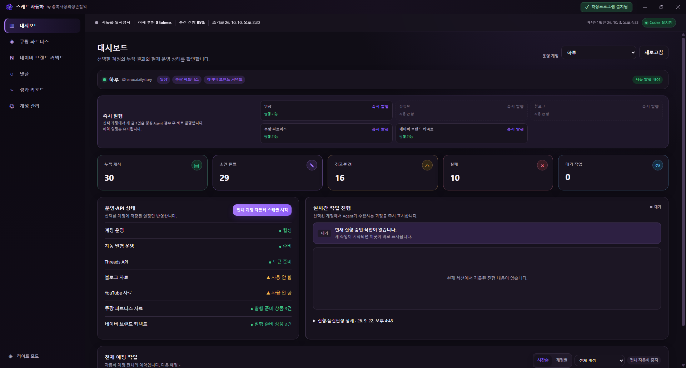

# Threads Auto · 스레드 자동화

**여러 Threads 계정의 콘텐츠 생성부터 예약 발행, 댓글 관리, 성과 확인까지 한곳에서.**

계정마다 주제와 말투를 설정하면 Codex CLI 기반 Agent가 글감을 고르고, 본문을 작성하고, 품질을 검토합니다. 일상 글과 블로그·YouTube·제휴 상품 콘텐츠를 계정별 운영 계획에 맞춰 관리할 수 있는 데스크톱 앱입니다.



## 주요 기능

- **계정마다 다른 목소리** — 주제·성격·말투·독자층·금지 표현을 설정하고 여러 계정을 함께 운영합니다.
- **생성부터 검수까지** — 역할별 Agent가 근거와 자연스러움을 검토하며, 중복 자료 전달을 줄여 불필요한 토큰 사용을 억제합니다.
- **예약·즉시 발행** — 운영 요일과 시간, 게시 수, 일상·홍보 비율을 설정하고 필요할 때 바로 발행합니다.
- **다양한 글감** — 블로그 RSS, YouTube, 쿠팡 파트너스, 네이버 브랜드 커넥트 상품을 활용합니다.
- **상품 수집과 발행 준비** — Chrome 확장프로그램으로 상품 이미지·후기 근거를 수집하고 콘텐츠를 준비합니다.
- **운영 현황을 한눈에** — 실시간 작업 진행, 댓글 처리, 게시물 성과, Codex 사용량을 확인합니다. 밝은·어두운 테마를 지원합니다.
- **로컬 데이터 보관** — 설정과 이력을 PC에 저장하고 인증정보는 운영체제 보안 저장소로 암호화합니다.

별도 OpenAI API 키 대신 **설치·로그인된 Codex CLI**를 사용합니다. 모델 사용량은 연결된 Codex 계정의 이용 한도와 과금 정책을 따릅니다.

## 개발자 모드 실행

### 준비

- Windows 또는 macOS
- **Node.js 24.15 이상인 24.x**와 npm, Git
- 설치·로그인된 [Codex CLI](https://developers.openai.com/codex/cli/)
- 상품 수집을 사용할 경우 Google Chrome과 아래 확장프로그램

```sh
git clone https://github.com/boksajang/threads-auto.git
cd threads-auto
npm run setup
npm start
```

`setup`은 고정된 의존성과 실행·빌드 도구를 준비합니다. `npm start`는 Electron 개발 모드로 실행합니다. PowerShell에서 실행 정책 오류가 나면 `npm` 대신 `npm.cmd`를 사용하세요.

앱의 **계정 관리**에서 Threads 장기 Access Token을 연결하고 계정 성격·콘텐츠·운영 계획을 설정하세요. YouTube API 키나 쿠팡 API 키는 해당 기능을 사용할 때 입력합니다. 키는 소스나 `.env`에 넣지 않습니다. 상품 수집은 아래 확장프로그램을 설치한 뒤 이용하세요.

### 검사

```sh
npm run check
```

TypeScript 검사와 lint를 실행합니다. 내부 테스트 폴더와 테스트 기록은 공개 저장소에 포함하지 않습니다.

## 빌드

초기 준비를 마쳤다면 프로젝트 루트에서 실행하세요.

```sh
npm run package   # 현재 OS용 실행 앱 생성
npm run make      # 실행 앱을 빌드하고 배포 파일 생성
```

| 운영체제 | 결과물 | 위치 |
| --- | --- | --- |
| Windows | 실행 폴더 / Squirrel 설치 프로그램 `.exe` | `out/` / `out/make/` |
| macOS | `.app` / 앱을 포함한 `.zip` | `out/` / `out/make/` |

**각 운영체제에서 해당 OS용으로 빌드합니다.** Windows 빌드·실행은 검증했으며, macOS는 지원 코드가 포함되어 있지만 실기기 검증이 필요합니다. 배포용 코드 서명과 macOS 공증은 별도 설정이 필요합니다.

## Chrome 확장프로그램 설치

쿠팡·네이버 상품의 이미지와 근거를 수집할 때 사용하는 **Threads Auto 쇼핑 상품 수집기**입니다.

### 웹 스토어에서 설치

1. 앱 상단의 **확장프로그램 설치** 버튼을 누릅니다.
2. Chrome에서 열린 스토어 페이지의 **Chrome에 추가 → 확장 프로그램 추가**를 선택합니다.
3. 앱으로 돌아와 **확장프로그램 설치됨** 표시를 확인합니다. 수집할 때는 확장을 설치한 Chrome 프로필과 앱을 모두 실행해 두세요.

### 소스에서 직접 설치

스토어 설치가 어렵거나 확장프로그램을 개발할 때 사용합니다.

1. 이 저장소를 내려받고 앱을 한 번 실행합니다. 앱이 로컬 통신에 필요한 Native Host를 등록합니다.
2. Chrome 주소창에 `chrome://extensions`를 입력하고 **개발자 모드**를 켭니다.
3. **압축해제된 확장 프로그램을 로드합니다**를 눌러 저장소의 **`chrome-extension` 폴더**를 선택합니다. 저장소 전체나 ZIP 파일을 선택하지 마세요.
4. 상품 페이지를 열고 앱에서 상품 수집을 실행합니다. 필요하면 쇼핑몰에 로그인하세요.

소스를 업데이트한 뒤에는 확장 관리 화면에서 **새로고침**을 누르고 열려 있던 상품 페이지도 새로고침하세요. 연결이 안 되면 앱을 재실행하고 같은 Chrome 프로필에서 확장이 활성화되어 있는지 확인하세요. 자세한 수집 범위는 [확장프로그램 안내](chrome-extension/README.md)를 참고하세요.

## 데이터 보관

개발 실행은 프로젝트의 `data/`, 새 독립 설치는 운영체제 사용자 앱 데이터 폴더 아래 `data/`를 사용합니다. 기존 Windows portable 앱 옆의 쓰기 가능한 `data/`는 계속 사용합니다.

백업은 앱을 종료한 뒤 데이터 폴더 전체를 보관하세요. 암호화된 인증정보는 다른 PC·사용자 계정에서 다시 입력해야 할 수 있습니다. 사용자 데이터·인증정보·빌드 결과물은 Git 업로드 대상에서 제외됩니다.
